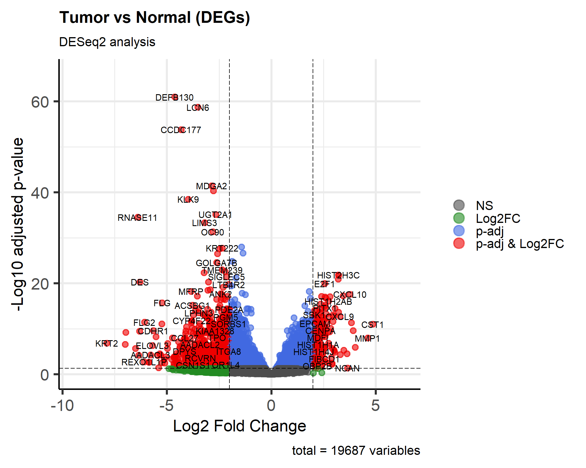

# Differential Gene Expression Analysis — Breast Tumor vs Normal (RNA-seq)

## Introduction
RNA sequencing enables sensitive, genome-wide quantification of gene
expression and is widely used to identify differentially expressed genes
(DEGs) between disease and healthy states. This repository provides a
reproducible pipeline for identifying DEGs between breast tumor and normal
tissue, characterizing them functionally, and evaluating their predictive
value with machine learning.

## Objective
Perform differential gene expression (DGE) analysis on breast tumor vs normal
tissue RNA-seq data, identify significant DEGs, run functional enrichment
(GO/KEGG), and build a Random Forest classifier on the top DEGs to evaluate
their discriminative power as candidate biomarkers.



*Volcano plot of DEGs (Tumor vs Normal): log2 fold change vs. -log10 adjusted
p-value, highlighting significantly up- and down-regulated genes. Generated
by `scripts/DEG_analysis.R` — see `results/plots/` for the full set of
figures (MA plot, heatmap, boxplots, KEGG/GO enrichment, RF feature importance).*

## Dataset
- **Source:** NCBI Gene Expression Omnibus (GEO), accession [GSE183947](https://www.ncbi.nlm.nih.gov/geo/query/acc.cgi?acc=GSE183947)
- **Samples:** 60 breast tissue samples — 30 tumor, 30 matched normal
- **Format:** Pre-normalized FPKM matrix, rounded to integers for DESeq2 input

## Repository Structure
```
DEG-Analysis-BreastCancer/
├── README.md
├── .gitignore
├── scripts/
│   └── DEG_analysis.R         # Full pipeline: data prep -> DESeq2 -> enrichment -> ML
├── data/
│   └── GSE183947_fpkm.csv     # (not tracked in git — see Data Availability)
├── results/
│   ├── plots/                 # All generated figures (volcano, MA, heatmap, boxplots, RF importance)
│   └── tables/                # DESeq2 result tables, RF model + metrics
└── docs/
    └── methodology.tex        # LaTeX writeup of methodology
```

## Tools & Packages
| Tool | Purpose |
|---|---|
| `DESeq2` | DEG identification from count data |
| `GEOquery` | Downloading matrix & metadata from GEO |
| `clusterProfiler` / `enrichplot` | GO enrichment analysis |
| `enrichR` | KEGG pathway & disease association enrichment |
| `ggplot2` | Boxplots, volcano plots, MA plots |
| `pheatmap` | Clustered heatmaps of DEGs |
| `randomForest` + `caret` | ML classification using top DEGs |

## Methodology (summary)
1. **Data acquisition** — Import FPKM matrix + GEO phenotype metadata.
2. **Metadata reshaping** — Clean tissue/metastasis annotations; convert wide → long format; merge with metadata.
3. **Count matrix construction** — Round FPKM to integers; build sample-condition table (Tumor/Normal), aligned by sample ID (rownames), not row position.
4. **DESeq2 DGE analysis** — Filter low-count genes, normalize, fit negative binomial GLM, extract Tumor vs Normal contrast. Significance: `padj < 0.05` & `|log2FC| ≥ 1`.
5. **Visualization** — Boxplots of top 5 DEGs, MA plot, volcano plot, clustered heatmap of top 50 DEGs.
6. **Functional enrichment** — GO Biological Process (clusterProfiler) and KEGG pathways (enrichR) on upregulated genes.
7. **ML classification (nested design)** — Samples are split into train (70%) and test (30%) *before* any DEG selection. DESeq2 is run using only the training samples to pick the top 10 genes used as classifier features; features are the resulting DESeq2-normalized, log2-transformed counts. Test samples are normalized against the training set's reference geometric means (`estimateSizeFactorsForMatrix()`), so no test-set information enters feature selection or normalization at any point. A Random Forest classifier (500 trees) is trained on the training features and evaluated on the held-out test set via confusion matrix and Gini-based feature importance.
8. **Cross-validation robustness check** — Because a single 70/30 split evaluates on only ~18 samples (where one misclassification moves accuracy by ~6 points), the identical nested procedure — training-only DEG selection, training-referenced test normalization, RF training/evaluation — is repeated across 5-fold cross-validation with 5 repeats (25 total fold fits), reporting mean accuracy, sensitivity, and specificity ± SD across folds. See `results/tables/RF_nested_CV_summary.csv`.

See `docs/methodology.tex` for the full write-up.

## Data Availability
Raw supplementary FPKM matrix should be downloaded from GEO (GSE183947) and
placed at `data/GSE183947_fpkm.csv` before running the script. Large data
files are excluded from version control (see `.gitignore`).

## Reproducing the analysis
```r
# from the repository root
source("scripts/DEG_analysis.R")
```

## Author
Sakshi Nagarkoti, M.Sc. Bioinformatics - Jamia Millia Islamia
